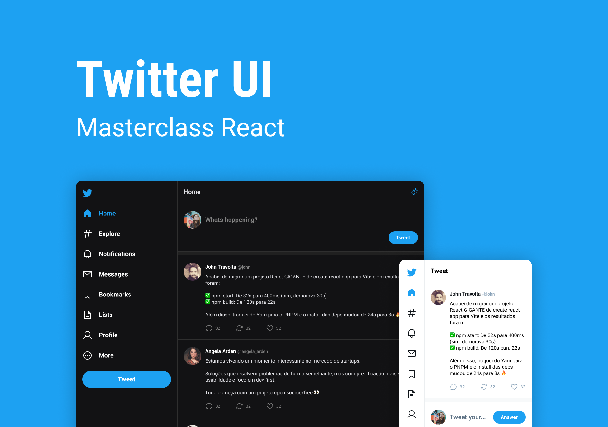

<h1 align="center"> Twitter UI </h1>

Fazendo a interface de usuário do Twitter para o estudo de ReactJS e ReactRouter  

  <a href="#-tecnologias">Tecnologias</a>&nbsp;&nbsp;&nbsp;|&nbsp;&nbsp;&nbsp;
  <a href="#-projeto">Projeto</a>&nbsp;&nbsp;&nbsp;|&nbsp;&nbsp;&nbsp;
  <a href="#-layout">Layout</a>&nbsp;&nbsp;&nbsp;|&nbsp;&nbsp;&nbsp;
  <a href="#memo-licença">Licença</a>

  

 

  

## 🚀 Tecnologias

Esse projeto foi desenvolvido com as seguintes tecnologias:

- HTML, CSS, JavaScript
- ReactJS e a bibloteca React Router
- Git e Github
- Figma

## 💻 Projeto

Refazer a interfâce do Twitter com fins de estudo de conceitos básicos de ReactJS e React Router 💡.

- [Visite o projeto online](https://main--visionary-toffee-b7e598.netlify.app/)

## 🔖 Layout

Você pode visualizar o layout do projeto através [desse link](https://www.figma.com/file/UFmEpuf42oPvDrBjueg2fv/Twitter-UI-(Community)?node-id=1%3A937&t=tt7Co72HMTyEb9Uh-0). É necessário ter conta no [Figma](https://figma.com) para acessá-lo.

## :memo: Licença

Esse projeto está sob a licença MIT.

---

Feito com ♥ by Pedro Klein